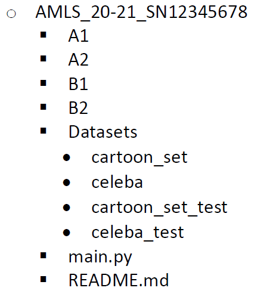

# AMLS Assignment 20-21
This repository contains the results for my attempt at the assignment
## The Organisation
In the folders A1, A2, B1, and B2, you will find both Jupyter Notebooks and Python files for each attempted model at the task as well as additional files that may be needed to run the code such as 
```bash
shape_predictor_68_face_landmarks.dat
```
The Datasets should be pasted into the folder labelled datasets in the following format.


Inside the sub folders for celeba and cartoon_set, there must be a folder labelled "img" and a csv file labelled "labels"
This also applies to the celeba_test and cartoon_set_test

## Roles
The Jupyter Notebooks in the will preprocess the images and labels and use them to train the model specified in the file name.
The ```main.py``` file contains all the essential parts of ```A1_SVM.ipynb```, ```A2_SVM.ipynb```, ```B1_SVM.ipynb``` and ``` B2_CNN.ipynb```.
Some modifications have been made to the feature extractor functions such that they run a little bit faster and eliminate some redundancies.
It should be noted that the preprocessing for A1 and A2 combined (if run at the same time) take around 3 hours.

## Packages used
```bash
Tensorflow
Numpy
MatPlotLib
Pandas
OpenCV
OS
DLib
Keras
Scikit Learn
Scikit Image
Pickle
```
```Pickle``` Need only be used if you plan on saving the model but there is no code as such in the ```main.py``` file, only in the individual task files.
